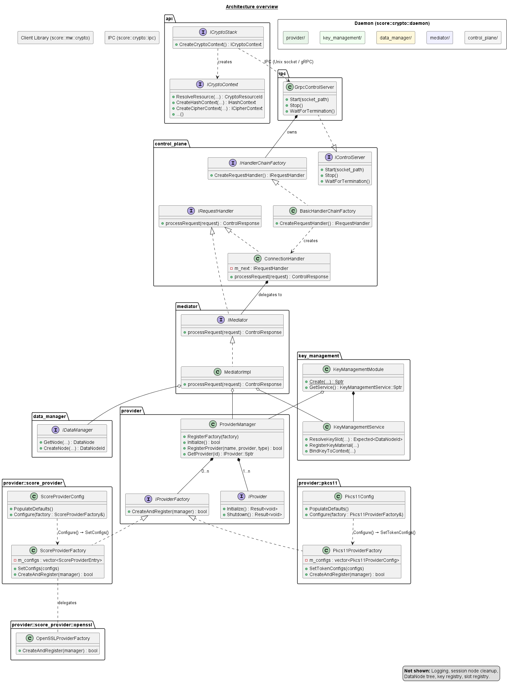

..
   # *******************************************************************************
   # Copyright (c) 2026 Contributors to the Eclipse Foundation
   #
   # See the NOTICE file(s) distributed with this work for additional
   # information regarding copyright ownership.
   #
   # This program and the accompanying materials are made available under the
   # terms of the Apache License Version 2.0 which is available at
   # https://www.apache.org/licenses/LICENSE-2.0
   #
   # SPDX-License-Identifier: Apache-2.0
   # *******************************************************************************

.. _component_architecture_template:

Component Architecture
======================

.. document:: Crypto Architecture
   :id: doc__crypto_architecture
   :status: draft
   :safety: QM
   :security: NO
   :realizes: wp__cmpt_request_dummy

.. workproduct:: Component Request Dummy
   :id: wp__cmpt_request_dummy
   :status: draft

Overview
--------

The ``score::mw::crypto`` module provides a provider-agnostic C++ (>=17) middleware
interface for cryptographic operations, key management, certificate lifecycle, and
shared memory allocation. It follows a client-daemon architecture where the
client library communicates with a daemon process over IPC.

The API is organized around a single runtime handle type —
``CryptoResourceId`` — that encapsulates a daemon-assigned 64-bit identifier,
resource type, persistence semantics, and owning provider index. Applications
resolve human-readable string identifiers to ``CryptoResourceId`` handles once,
then use these compact numeric handles for all subsequent operations.

Key design principles:

- **Provider-agnostic**: Operations work identically across hardware (HSM, TEE)
  and software (OpenSSL, SoftHSM) providers
- **PQC-ready**: ``AlgorithmId`` uses strings for extensibility, supporting
  ML-KEM, ML-DSA, SLH-DSA, XMSS, LMS, and SHAKE algorithms
- **Ephemeral-by-default keys**: All key generation produces ephemeral keys;
  explicit ``PersistKey()`` promotes to persistent storage
- **Zero-copy data plane**: Provider-compatible shared memory enables
  zero-copy from application through daemon to crypto device
- **Backward-compatible extensibility**: All configs use default constructors
  with fluent builders; new optional fields never break existing callers

Requirements Linked to Component Architecture
---------------------------------------------

.. This section will be populated with requirement traceability links.

.. needtable:: Overview of Component Requirements
   :style: table
   :columns: title;id
   :filter: search("comp_arch_sta__archdes$", "fulfils_back")
   :colwidths: 70,30

.. toctree::
   :maxdepth: 2
   :caption: Architecture Details

   api_architecture
   api_description
   dynamic_architecture
   interfaces
   provider_architecture
   key_management_details
   design_decisions

Static Architecture
-------------------

The components are designed to cover the expectations from the feature architecture
(i.e. if already exists a definition it should be taken over and enriched).

.. comp:: Crypto
   :id: comp__crypto
   :security: YES
   :safety: QM
   :status: invalid
   :implements:

.. TODO: Merge the below description into more appropriate sections when more details are available.

Provider Layer
--------------

The provider layer decouples the daemon from concrete cryptographic library implementations
through two complementary abstractions:

``IProvider``
   The single entry-point into one cryptographic back-end (e.g. OpenSSL, a PKCS#11 token).
   Exposes ``GetCryptoHandlerFactory()``, ``GetKeyFactory()``, and ``GetKeySlotHandler()``.
   Lifecycle is managed by ``ProviderManager``.

``IProviderFactory``
   A pure-virtual factory interface with a single method
   ``bool CreateAndRegister(ProviderManager&)``.
   Concrete implementations encapsulate the construction and registration of one or more
   related ``IProvider`` instances.  Factories are registered externally
   (daemon bootstrapper) via ``ProviderManager::RegisterFactory()`` and called in
   registration order during ``ProviderManager::Initialize()``.

``ScoreProviderFactory``
   Top-level factory for the **score interface family**.  Accepts a vector of
   ``ScoreProviderEntry`` configs (default: single OpenSSL entry).
   ``CreateAndRegister()`` iterates configs and delegates to the appropriate
   internal factory (e.g. ``OpenSSLProviderFactory``).

``OpenSSLProviderFactory``
   Internal factory used by ``ScoreProviderFactory``.  Constructs
   ``score::openssl::OpenSSL`` and registers it as ``CryptoProviderType::SOFTWARE``
   under the ``common::kProviderNameOpenSSL`` name.  No per-instance configuration required.

``Pkcs11ProviderFactory``
   Accepts an injected ``std::vector<Pkcs11ProviderConfig>`` via
   ``SetTokenConfigs()`` (the acceptor side of the visitor pattern) or
   through its explicit vector constructor.  The daemon bootstrapper does
   not build configs directly; it delegates to ``Pkcs11Config::Configure()``:

   .. code-block:: cpp

      config.GetPkcs11Config().PopulateDefaults();
      auto factory = std::make_unique<Pkcs11ProviderFactory>();
      config.GetPkcs11Config().Configure(*factory);
      manager.RegisterFactory(std::move(factory));

   ``CreateAndRegister`` creates a single shared ``Pkcs11Module`` (so
   ``C_Initialize`` is invoked exactly once regardless of token count),
   then constructs and registers one ``Pkcs11Provider`` per entry as
   ``CryptoProviderType::HARDWARE``.

   **Visitor pattern** — ``Pkcs11Config::Configure()`` is the visitor:
   it iterates the ``Pkcs11TokenEntry`` list, converts each entry to a
   ``Pkcs11ProviderConfig`` (filling labels, PIN, cleanup strategy), and
   calls ``factory.SetTokenConfigs()``.
   This keeps the ``Pkcs11TokenEntry → Pkcs11ProviderConfig`` conversion
   entirely within the PKCS#11 subsystem
   (``score/crypto/daemon/provider/pkcs11/pkcs11_token_config.*``).

   **Multi-token coexistence**: multiple ``Pkcs11TokenEntry`` entries in
   ``Pkcs11Config`` produce one ``Pkcs11Provider`` per token.
   All providers from the same factory share a single ``Pkcs11Module``
   (``C_Initialize`` / ``C_Finalize`` is called once), but each provider
   maintains its own session pools, ``TokenAuthGuard``, and
   ``Pkcs11KeyStore``.  Login state and key registrations are fully isolated.
   This design supports scenarios such as separate SoftHSM slots for
   different trust domains within the same process.

   For session lifecycle details see
   :ref:`pkcs11_session_management` in the key management details.

``ProviderManager``
   Aggregates all registered providers and routes requests by ``ProviderId`` or
   ``CryptoProviderType``.  After all factories have been called, ``Initialize()``
   applies the daemon configuration and calls ``Initialize()`` on every provider.

Dynamic Architecture
--------------------

The typical interaction sequence between Application, Client Library, and Crypto Daemon:

.. uml:: typical_usage_sequence.puml
   :align: center
   :scale: 75

See :ref:`crypto_dynamic_architecture` for detailed usage flows including
pre-deployed key paths, ephemeral key generation, context reuse, PQC signing,
certificate verification, and timeout configuration.

Interfaces
----------

See :ref:`crypto_interfaces` for the full interface descriptions.

Design Decisions
----------------

See :ref:`crypto_design_decisions` for the full design decision records.
